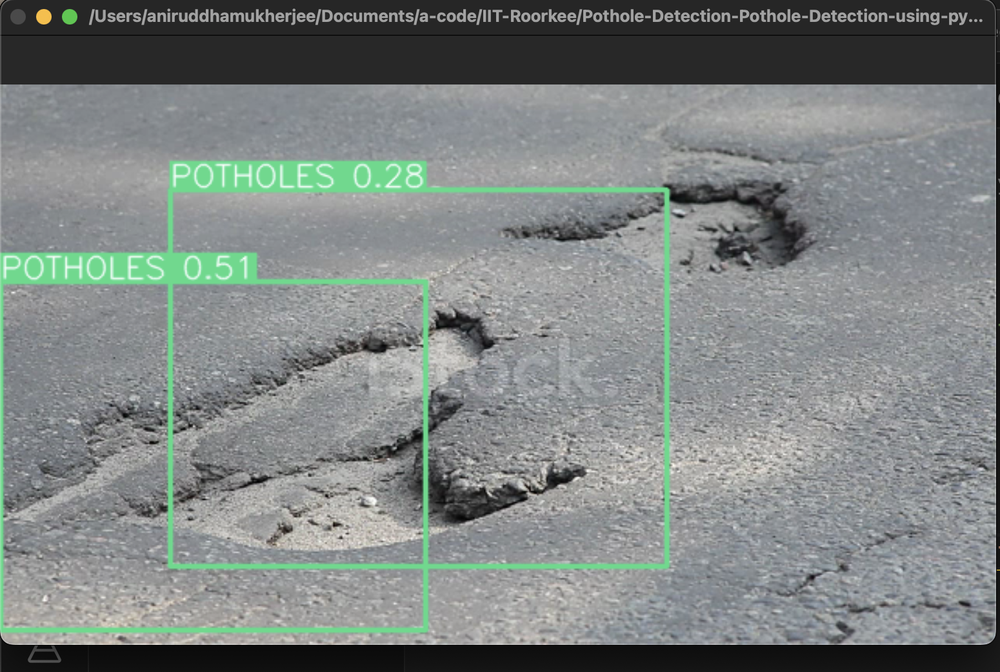
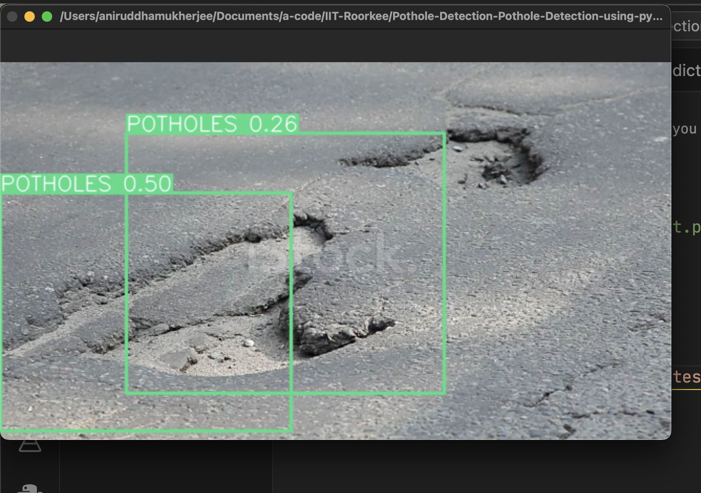
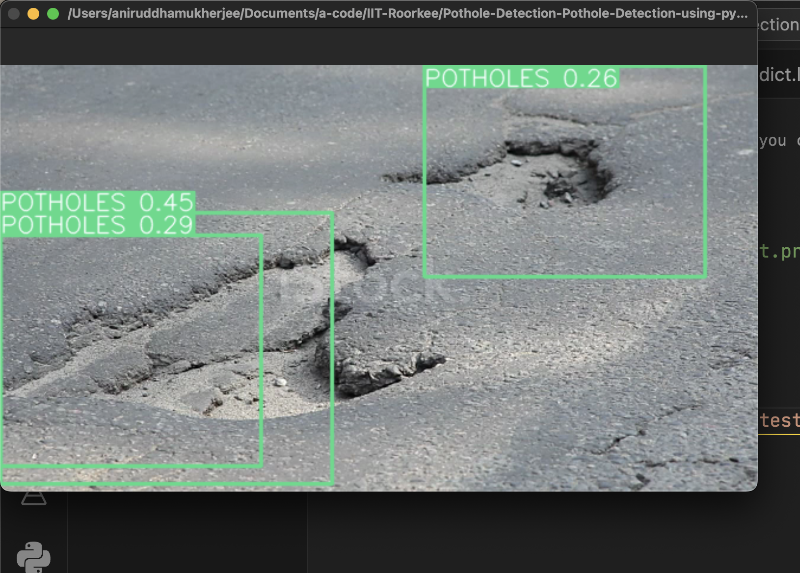

# Pothole Detection 


### Dataset Used
> ⁠which dataset -> stats of the dataset, how many images etc. and that it’s widely used…

_pls fill_

### Model Details
> ⁠⁠which model was used and technical details about the model

*YOLO-V8.* (add more details)

### Problem Statement
> ⁠why the model is useful (i.e. what problem is it solving and how is it benefiting mankind)

Helps to detect potholes

### Model Pros...
> ⁠why the particular model selected by us is great (high high accuracy, state of the art, low inference time)

_fill_


## Steps to run Code
- Clone the repository.
```
git clone https://github.com/annimukherjee/Road-Safety-ModelZoo/tree/main
```
- Goto the cloned folder.
```
cd 1_Pothole-Detection

```
- Upgrade pip with the mentioned command below.
```
pip install --upgrade pip
```

- Create a virual env:

```
conda create -n pothole-env python=3.8
conda activate pothole-env
```

- Install requirements with the mentioned command below.

```
pip install -r reqs.txt
```

- Run the code with the mentioned command below.

 - Run for webcam: `python test.py`


---

> can run the below however it's optional:

    `python predict.py model=y8best.pt source="demo.mp4" show=True`

    `python predict.py model=y8best.pt source=0 show=True`


download weight `y8best.pt`: https://drive.google.com/drive/folders/1T1h2WH3_wrNb0foJuDw8w33Br_2kZjnS?usp=share_link


<br>

## ⁠results

## ⁠Results

**Video Demo**

[https://github.com/annimukherjee/Road-Safety-ModelZoo/assets/85307430/e21f500a-db8b-464c-ab8c-d0643d109252](https://github.com/annimukherjee/Road-Safety-ModelZoo/assets/85307430/e21f500a-db8b-464c-ab8c-d0643d109252)

<p align="center">
  
</p>
<p align="center">
  
</p>
<p align="center">
  
</p>


