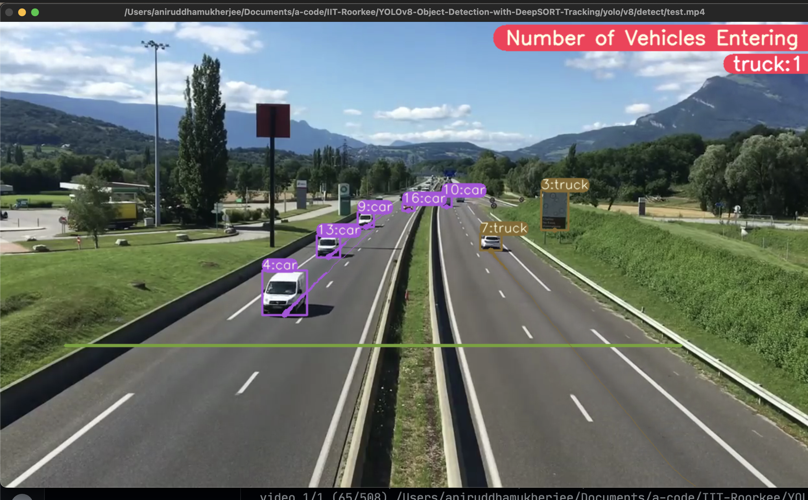
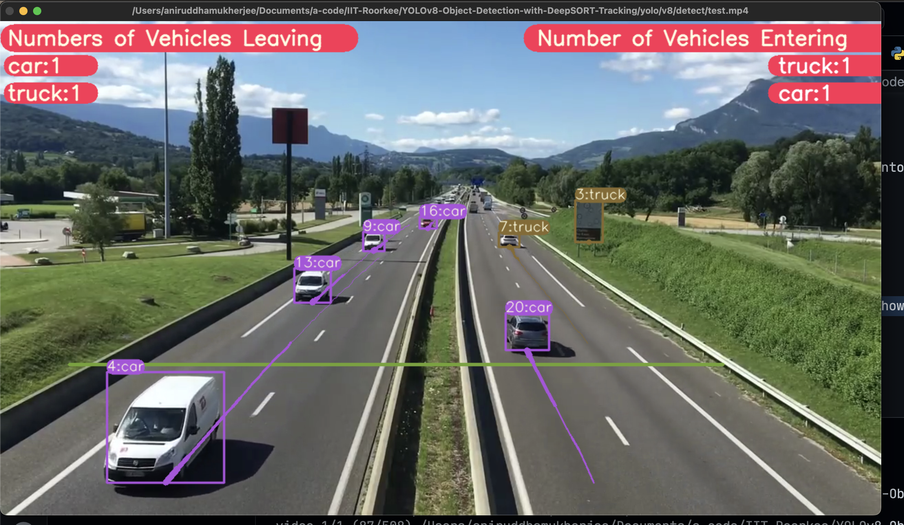
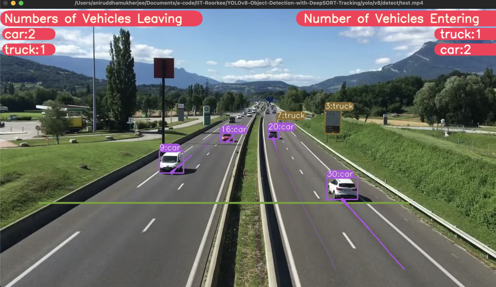
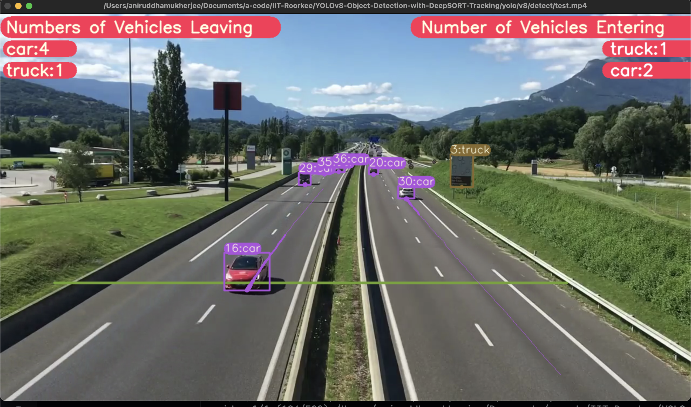

# YOLOv8-with-DeepSORT-Tracking-Number-Of-Cars-InOut

### Features

YOLOv8 Object Detection with DeepSORT Tracking(ID + Trails)

### Dataset Used

> ⁠which dataset -> stats of the dataset, how many images etc. and that it’s widely used…

_pls fill_

### Model Details

> ⁠⁠which model was used and technical details about the model

_YOLO-V8._ (add more details)

### Problem Statement

> ⁠why the model is useful (i.e. what problem is it solving and how is it benefiting mankind)

Helps to detect potholes

### Model Pros...

> ⁠why the particular model selected by us is great (high high accuracy, state of the art, low inference time)

_fill_

## Steps to run Code

-   Clone the repository

```
git clone ...
```

-   Goto cloned folder

```
cd 2_DeepSORT-Tracking-Number-Of-Cars-InOut
```

-   Install the ultralytics package

```
pip install ultralytics==8.0.0
```

-   Setting the Directory.

```
cd yolo/v8/detect
```

-   Do Tracking

```
# video file
python tracking_vehicle_counting.py model=yolov8l.pt source="test.mp4" show=True
```

## Results

<video src="runs/detect/train/test.mp4" controls title="Demo"></video>

<br>
<br>





